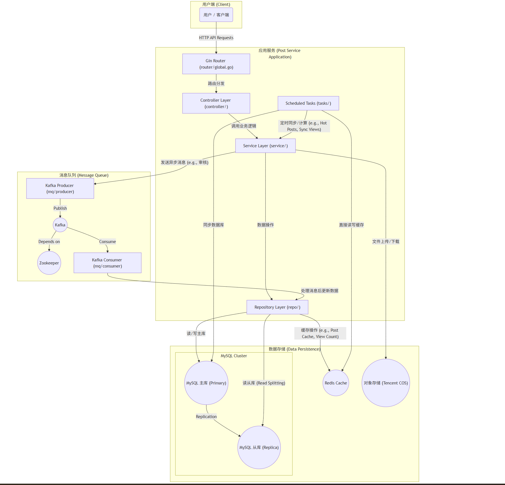

# 帖子服务 (Post Service) — 高性能与高可用架构实践


本项目是一个使用 Go 语言构建的、可观测的、工程化的高性能后端服务，专注于处理帖子相关业务。它不仅仅是一个简单的 CRUD 服务，更是在**高并发读写、数据一致性、服务解耦**等方面进行了深度实践的微服务典范。

## 核心设计与技术亮点

-   🚀 **高并发设计**:
    -   **读写分离**: 采用 MySQL 主从架构，将读请求分发至从库，写请求路由至主库，显著提升数据库并发处理能力和系统弹性。
    -   **并发同步**: 后台任务采用 `goroutine` 和 `sync.WaitGroup` 并发执行批量写操作，极大提升了 Redis 数据同步回 MySQL 的效率。

-   🧠 **精细化缓存策略**:
    -   **热点数据缓存**: 使用 Redis `ZSet` 维护热点帖子排行，高效获取 Top-N 数据。
    -   **缓存防刷与防穿透**: 巧妙利用 Redis 的 `INCR` 实现原子计数，并结合 **布隆过滤器 (Bloom Filter)** 防止对不存在数据的恶意缓存穿透攻击，保护数据库。

-   🔗 **异步解耦与削峰填谷**:
    -   **事件驱动**: 引入 Kafka 消息队列，将帖子创建后的审核、删除等非核心、耗时操作异步化，提升主流程响应速度，增强系统容错性。

-   🧱 **清晰的领域模型分层**:
    -   **DDD 思想借鉴**: 采用 **Entity (实体) / DTO (数据传输对象) / VO (视图对象)** 的三层模型结构，实现了各层职责分离，使得代码逻辑清晰、易于维护和扩展。

-   🔭 **全面的可观测性**:
    -   **结构化日志**: 集成 `Zap` 库，提供高性能的结构化日志记录。
    -   **分布式追踪**: 通过 `OpenTelemetry` 实现了链路追踪，便于快速定位分布式系统中的性能瓶颈和错误。

-   🛠️ **完善的工程化实践**:
    -   **容器化**: 提供 `docker-compose` 配置，实现一键部署所有服务 (MySQL, Redis, Kafka, App)，简化开发和部署流程。
    -   **API 文档**: 使用 `Swaggo` 自动生成交互式 Swagger API 文档，提升协作效率。
    -   **配置驱动**: 使用 `Viper` 管理 YAML 配置文件，支持多环境配置加载。

## 架构图 (Architecture Diagram)

下图展示了本服务的核心架构、组件和数据流。



## 系统设计与技术实现详解

#### 1. 高性能数据库架构

为了应对高并发读取的场景，我们设计了 MySQL 主从(读写分离)架构。
-   **主库 (Primary)**: 负责处理所有写操作（INSERT, UPDATE, DELETE）。
-   **从库 (Replica)**: 负责处理所有读操作（SELECT）。
-   **数据同步**: 定时任务 (`tasks/view_count_sync.go`) 中，将 Redis 的浏览量同步回数据库时，通过**并发的 Goroutines** 将数据分批，并批量写入**主库**，实现了高效的数据持久化。

#### 2. 精细化缓存策略

缓存不仅是提升性能的利器，更是保护系统的第一道防线。
-   **热榜缓存**: 使用 Redis 的有序集合 `ZSet` 存储帖子的浏览量，天然支持排序，用于实现热榜功能。
-   **浏览量计数器**: 使用 Redis 的原子操作 `INCR` 作为计数器，保证并发下的数据一致性。
-   **防穿透-布隆过滤器**: 在 `constant/bloom.go` 中定义并使用。当查询一个帖子时，如果布隆过滤器判定其**绝对不存在**，则直接返回，避免了对缓存和数据库的无效查询，有效抵御了缓存穿透攻击。

#### 3. 异步消息队列

Kafka 在本系统中扮演了“缓冲层”和“解耦器”的角色。
-   **场景**: 当一个新帖子被创建后，需要进行人工或自动审核。
-   **流程**: `Post Service` 在帖子数据入库后，向 Kafka 的 `audit-topic` 发送一条消息。独立的消费者 (`mq/consumer/audit_handler.go`) 监听此主题，拉取消息并执行审核逻辑。
-   **优势**: 即使审核服务暂时宕机，消息也会保留在 Kafka 中，待服务恢复后可继续处理，保证了系统的最终一致性和高可用性。

#### 4. 清晰的领域模型分层

为了代码的可维护性，我们严格划分了模型职责：
-   **Entity (`models/entities`)**: 与数据库表结构一一对应，由 GORM 使用。
-   **DTO (`models/dto`)**: 数据传输对象，用于 `Service` 层与 `Repo` 层，以及 `Controller` 层与 `Service` 层之间的数据传递，用于隐藏领域细节。
-   **VO (`models/vo`)**: 视图对象，由 `Controller` 层返回给前端。它根据前端页面的需要对数据进行裁剪和组装，避免敏感或冗余数据泄露。

## 技术栈

| 类别 | 技术 | 描述 |
| :--- | :--- | :--- |
| **核心语言** | `Go` | 现代、高效的并发编程语言。 |
| **Web 框架** | `Gin` | 高性能的 HTTP Web 框架。 |
| **ORM** | `GORM` | 功能强大的 Go ORM 库，简化数据库操作。 |
| **数据库** | `MySQL` | 主从复制架构，实现读写分离。 |
| **缓存** | `Redis` | 包括 Redis Stack 功能，如 Bloom Filter。 |
| **消息队列** | `Kafka` | 分布式事件流平台，用于异步处理。 |
| **日志** | `Zap` | 高性能、结构化的日志库。 |
| **配置** | `Viper` | Go 应用程序的完整配置解决方案。 |
| **可观测性** | `OpenTelemetry` | 用于实现分布式追踪。 |
| **对象存储** | `Tencent COS` | 用于存储图片、视频等媒体文件。 |
| **API 文档** | `Swaggo` | Go 的 Swagger 实现，自动生成文档。 |
| **容器化** | `Docker` | 用于应用的打包、分发和运行。 |

## 安装与运行

#### 环境要求
- Go (版本 >= 1.18)
- Docker & Docker Compose

#### 步骤
1.  **克隆仓库**
    ```bash
    git clone <your-repository-url>
    cd post_service
    ```
2.  **配置检查**
    请检查 `config/config.development.yaml` 文件。大部分配置已与 `docker-compose.yaml` 对齐，通常无需修改即可本地运行。

3.  **启动所有服务**
    此命令将一键启动应用服务及所有依赖（MySQL主从、Redis、Kafka、Zookeeper）。
    ```bash
    docker-compose up -d
    ```

4.  **查看服务状态**
    ```bash
    docker-compose ps
    ```
    确保所有服务的状态为 `Up` 或 `healthy`。

5.  **(可选) 运行原生 Go 应用**
    如果您不想通过 Docker 运行 Go 应用，可以单独启动依赖后，在本地运行：
    ```bash
    # 确保依赖已通过 docker-compose up 启动
    go run main.go -config=config/config.development.yaml
    ```

## API 文档

服务启动后，在浏览器中访问以下地址即可查看 Swagger UI 交互式文档：

**`http://localhost:8080/swagger/index.html`**

## 项目结构

```
.
├── cmd/            # 数据填充等命令行工具
├── config/         # Viper 使用的 YAML 配置文件及 Go 结构体
├── constant/       # 全局常量 (Redis Keys, Kafka Topics, Cron Specs)
├── controller/     # Gin Handlers，负责解析请求和返回响应
├── dependencies/   # 外部依赖的初始化 (DB, Redis, Logger, etc.)
├── docs/           # Swaggo 自动生成的文档文件
├── models/         # 清晰分层的领域模型 (DTOs, Entities, VOs)
├── mq/             # Kafka 生产者和消费者
├── myErrors/       # 自定义错误类型
├── repo/           # 仓储模式实现，封装数据持久化逻辑 (MySQL & Redis)
├── router/         # Gin 路由和中间件的注册
├── service/        # 核心业务逻辑层
├── tasks/          # Cron 定时任务 (热榜计算、数据同步)
├── docker-compose.yaml # 服务编排文件
├── main.go         # 应用主入口
└── README.md       # 本文档
```

## 贡献

我们欢迎任何形式的贡献，无论是提交 Issue 还是 Pull Request。

## 许可证

本项目采用 [Apache 2.0 许可证](./LICENSE)。
